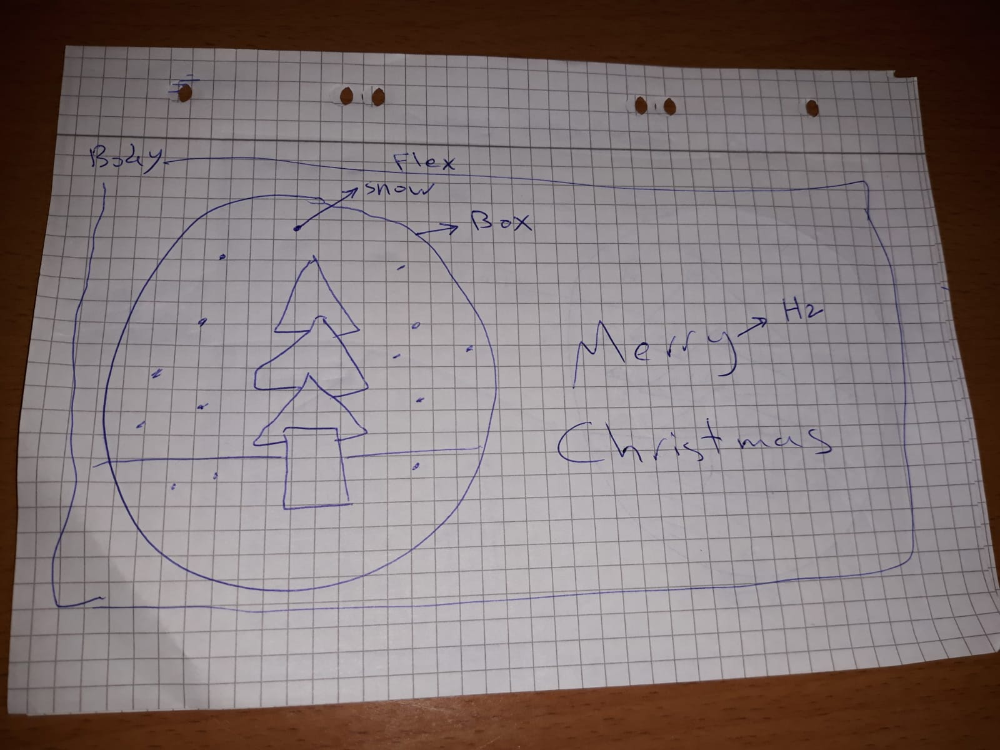

# Project log

Christmas Tree.

## Overview

A christmas tree with some animations.

## Details

- This project isn't a real project. It is a practice for me.
- The intended user is only ME.
- The required content is CSS art and animations, I will need to get some help from reading articles
  and watching Youtube videos and checking my teacher's lessons then I will start to code.
- My "To-Do-List" :
  1. Create 2 accounts on LastPass and Toggl websites.
  2. Prepare GitHub and file system environment.
  3. Design WireFrames for the project.
  4. Research new concepts.
  5. Start coding and try to solve the problems.
  6. Debug and test and find someone to check my project.
  7. publish the project to CodePen and to GitHub.

## Wireframes

## Time

- Estimated: 5 days --> 10 Uhr
- Actual: 7 Uhr, Wed: 4 Uhr, Sat: 2:30 Uhr, Sun: 30 Minutes.

## New skills

@keyframes, animation property, transform property, how to make many layers of images.

## Achievements

I learned how to deal with animations with pure CSS by playing with the key-frames query.

## Buddy sign-off

Natalia
