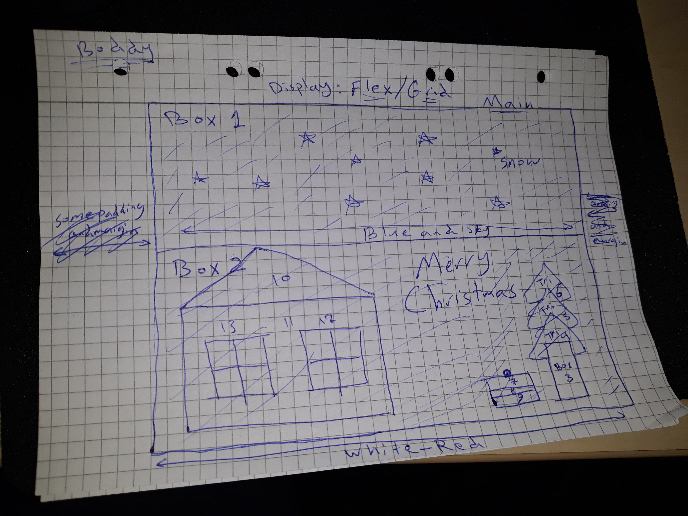

# Project log

Christmas Tree.

## Overview

This is my first project with pure HTML and CSS. <!--to do-->

## Details

- This project isn't a real project. It is a practice for me.
- The intended user is only ME.
- The required content is CSS art and animations, I will need to get some help from reading articles
  and watching Youtube videos and checking my teacher's lessons then I will start to code.
- My "To-Do-List" :
  1. Create 2 accounts on LastPass and Toggl websites.
  2. Prepare GitHub and file system environment.
  3. Design WireFrames for the project.
  4. Research new concepts.
  5. Start coding and try to solve the problems.
  6. Debug and test and find someone to check my project.
  7. publish the project to CodePen and to GitHub.

## Wireframes

## Time

- Estimated: 3 days --> 15 Uhr <!--To do-->
- Actual: <!--To do-->

## New skills

(what did you research for this project?) <!-- to do-->

## Challenges + lessons learned

(What didn't go well? How would you advise future-you so it goes better next time?) <!--to do-->

## Achievements

(What did you do this time that was an improvement on last time? Acknowledge your progress, you've earned it!)<!--to do-->

## Buddy sign-off

Natalia
